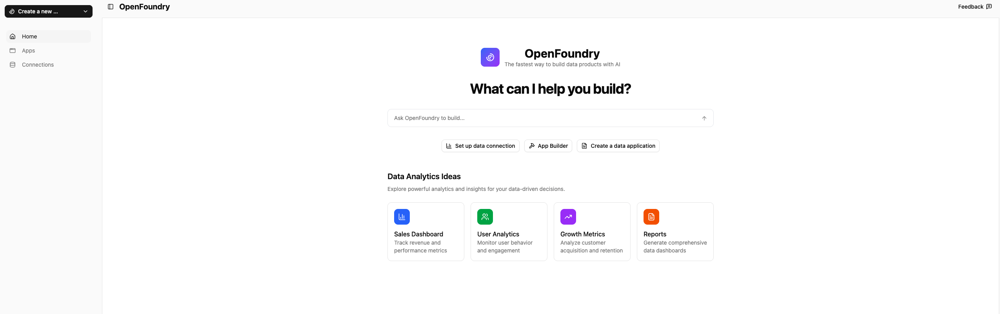

#  OpenFoundry
**The fastest way to build data products with AI.**

Welcome to OpenFoundry, a platform for analysts and non‑technical users to build powerful data products with the help of AI agents. OpenFoundry helps you build rich dashboards, analyses, and data applications on top of your private data by taking care of all of the code implementation and data connections underneath.

- **Totally transparent** – peek under the hood of every AI feature
- **Fully customizable** – plug in your own tools and workflows
- **Instant setup** – run in your environment in minutes

**Take back full control** — over your data and the AI that works with it.



## 🚀 Features

### Core Capabilities
- **AI-Powered App Development**: Build interactive Streamlit applications using intelligent agents
- **AI-powered Notebook Development**: Utilize agents to generate code, visualize data, and streamline your analysis in your Notebooks
- **Data Connection Management**: Connect to Snowflake, Databricks, and other data sources
- **Secure Sandbox Environment**: Isolated Docker containers for safe code execution
- **Run Locally on Private Data**: Deploy and operate OpenFoundry entirely on your own infrastructure, ensuring your data never leaves your environment

### Data Connections
- **Snowflake**: Full support for Snowflake data warehouse connections
- **Databricks**: Connect to Databricks SQL endpoints
- **BigQuery**: Connect to BigQuery
- **ClickHouse**: Connect to ClickHouse
- **Postgres**: Connect to PostgreSQL
- **Extensible Architecture**: Easy to add new connection types

## 📦 Installation

### Prerequisites
- Python 3.12+
- Node.js 20+
- Docker
- Poetry (Python package manager)
- Git

### Quick Start

1. **Clone the repository**
   ```bash
   git clone https://github.com/Shadowfax-Data/OpenFoundry.git
   cd OpenFoundry
   ```

2. **Install dependencies**
   ```bash
   make install
   ```

3. **Set up environment variables**
   ```bash
   cp .env.example .env
   # Edit .env with your configuration
   ```

4. **Run the application**
   ```bash
   make run-openfoundry
   ```

The application will be available at `http://localhost:8000`

## 🤝 Contributing

We welcome contributions! Please see our [Contributing Guide](CONTRIBUTING.md) for details.

### Development Setup
1. Fork the repository
2. Create a feature branch
3. Make your changes
4. Add tests if applicable
5. Submit a pull request

### Code Style
- Follow the existing code style and conventions
- Use TypeScript for frontend code
- Add type hints to Python functions
- Write clear commit messages

## 🆘 Support

- **Documentation**: To learn more about the project, and tutorials on using OpenFoundry, check out our [documentation](https://shadowfax-data.github.io/OpenFoundry/)
- **Issues**: Report bugs and feature requests on [GitHub Issues](https://github.com/Shadowfax-Data/OpenFoundry/issues)
- **Discussions**: Join community discussions on [GitHub Discussions](https://github.com/Shadowfax-Data/OpenFoundry/discussions)

## 🏢 About

OpenFoundry is developed by [Shadowfax AI](mailto:founders@shadowfaxdata.com).

---

**Built with ❤️ for the data community**
